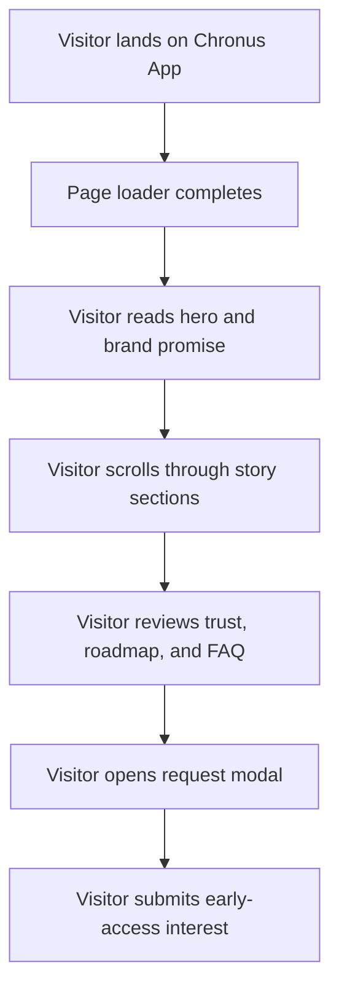

## 1. Product Overview
Chronus App is a single-page marketing website for a futuristic productivity and time-management product. It presents the brand, explains value clearly, and captures early-access interest through a request modal.

- Primary goal: ship a polished landing experience with modular React components and smooth scrolling behavior.
- Target users: founders, operators, productivity enthusiasts, and early adopters evaluating a premium workflow tool.

## 2. Core Features

### 2.1 Feature Module
1. **Home page**: page loader, sticky header, hero narrative, marquee band, feature storytelling sections, FAQ, footer, and request modal.
2. **Interaction layer**: smooth scrolling hook, quote rotation, navigation menu, and modal open/close flow.

### 2.2 Page Details
| Page Name | Module Name | Feature description |
|-----------|-------------|---------------------|
| Home page | `PageLoader` | Displays a short branded loading state before revealing the page. |
| Home page | `Header` | Provides top-level navigation and request access CTA. |
| Home page | `Hero` | Communicates positioning, value proposition, and primary actions. |
| Home page | `Marquee` | Shows looping brand statements or trust snippets. |
| Home page | `WhySection` | Explains the problem space and why Chronus matters. |
| Home page | `Band` | Adds a visual divider with concise highlight messaging. |
| Home page | `HowItWorks` | Breaks the product journey into simple steps. |
| Home page | `Features` | Highlights core product capabilities in a scannable format. |
| Home page | `QuoteRotator` | Rotates quotes or product statements for motion and emphasis. |
| Home page | `TrustSection` | Builds confidence with logos, metrics, or credibility statements. |
| Home page | `UnderHood` | Describes the technical craft or intelligence behind the product. |
| Home page | `Roadmap` | Shows near-term milestones and direction. |
| Home page | `FAQ` | Resolves common objections and onboarding questions. |
| Home page | `Footer` | Offers navigation recap and brand close. |
| Home page | `NavMenu` | Supports mobile or compact navigation presentation. |
| Home page | `RequestModal` | Collects early-access requests with a lightweight form. |
| Home page | `useLenis` | Enables reusable smooth-scroll behavior and cleanup. |

## 3. Core Process
The visitor lands on the homepage, sees a premium introduction, scrolls through proof and feature storytelling, checks roadmap and FAQ details, and submits an early-access request through the modal when convinced.

## 4. User Interface Design

### 4.1 Design Style
- Primary colors: deep charcoal, muted ivory, electric cyan accents.
- Secondary accents: slate blue and subtle metallic gradients.
- Button style: rounded-pill buttons with crisp hover lift and glow.
- Typography: high-contrast editorial display font paired with a clean sans-serif body font.
- Layout style: desktop-first storytelling layout with stacked sections, sticky navigation, and alternating content rhythm.
- Icon style suggestions: minimal line icons and restrained geometric dividers.

### 4.2 Page Design Overview
| Page Name | Module Name | UI Elements |
|-----------|-------------|-------------|
| Home page | Hero | Large heading, compact supporting copy, CTA pair, spotlight card, soft background gradients |
| Home page | Narrative sections | Alternating text and cards, subtle reveal motion, section labels, timeline cues |
| Home page | Trust and FAQ | Logo rail, stat blocks, bordered accordion rows, muted contrast surfaces |
| Home page | Modal | Frosted overlay, concise form fields, direct confirmation state |

### 4.3 Responsiveness
Desktop-first layout with tablet and mobile adaptation. Sections collapse into single-column stacks, navigation becomes menu-driven, and interaction targets remain touch-friendly.
