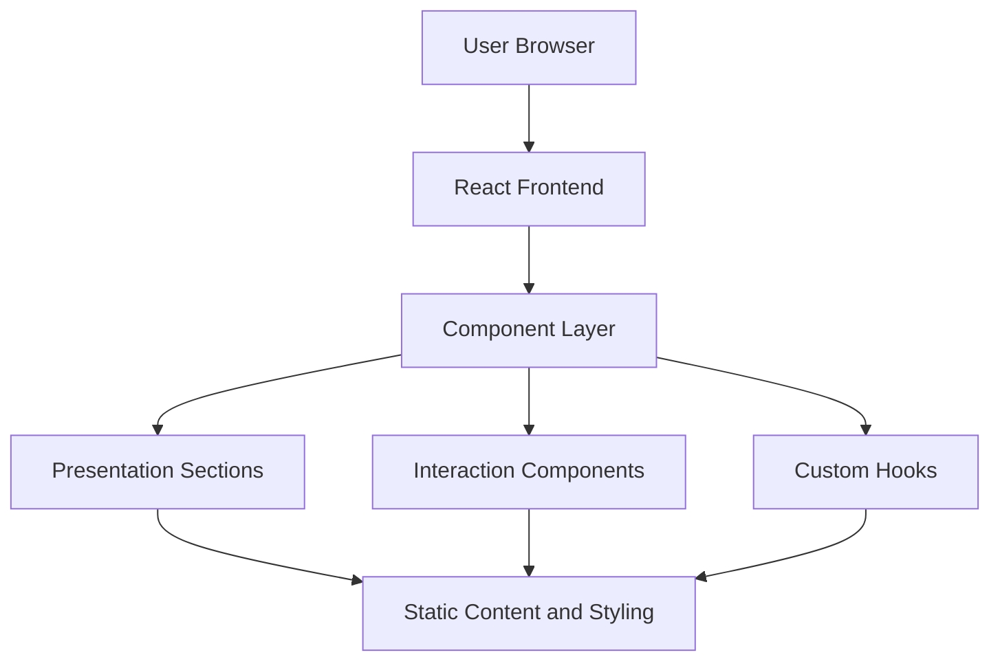

## 1. Architecture Design

## 2. Technology Description
- Frontend: React 18 + Vite + plain CSS
- Runtime: Node.js with npm
- Entry pattern: `main.jsx` bootstraps `App.jsx`, which composes the landing page from reusable section components
- Styling: centralized `App.css` for tokens, layout, section themes, and animation utilities

## 3. Route Definitions
| Route | Purpose |
|-------|---------|
| / | Single landing page for Chronus App marketing and request capture |

## 4. API Definitions
No backend APIs are required in the initial scaffold. The request modal uses local component state and may later connect to a form endpoint or CRM integration.

## 5. Component Structure
| Path | Responsibility |
|------|----------------|
| `src/main.jsx` | Creates the React root and mounts the app |
| `src/App.jsx` | Orchestrates layout, modal state, and section order |
| `src/App.css` | Holds visual system, responsive layout, and shared animations |
| `src/components/PageLoader.jsx` | Intro loading state |
| `src/components/Header.jsx` | Desktop header and primary CTA |
| `src/components/Hero.jsx` | Hero copy and above-the-fold actions |
| `src/components/Marquee.jsx` | Looping brand strip |
| `src/components/WhySection.jsx` | Problem framing |
| `src/components/Band.jsx` | Highlight divider section |
| `src/components/HowItWorks.jsx` | Step-by-step flow |
| `src/components/Features.jsx` | Feature grid |
| `src/components/QuoteRotator.jsx` | Rotating quotes or claims |
| `src/components/TrustSection.jsx` | Trust signals and metrics |
| `src/components/UnderHood.jsx` | Technical depth section |
| `src/components/Roadmap.jsx` | Milestone timeline |
| `src/components/FAQ.jsx` | Frequently asked questions |
| `src/components/Footer.jsx` | Footer links and sign-off |
| `src/components/NavMenu.jsx` | Compact navigation for smaller screens |
| `src/components/RequestModal.jsx` | Overlay form UI |
| `src/hooks/useLenis.js` | Smooth scrolling behavior hook with setup and cleanup |

## 6. Data Model
No persisted data model is required for the initial version.

### 6.1 Local UI State
| State | Owner | Purpose |
|-------|-------|---------|
| `isLoading` | `App.jsx` | Controls the page loader visibility |
| `isRequestOpen` | `App.jsx` | Controls the request modal |
| `isNavOpen` | `Header` or `App.jsx` | Controls compact navigation visibility |
| `activeQuoteIndex` | `QuoteRotator.jsx` | Rotates visible quote content |

### 6.2 Implementation Notes
- Components remain presentational where possible and receive data through props.
- Shared arrays for navigation, features, quotes, roadmap items, and FAQ entries can live close to their section components unless reuse demands extraction.
- `useLenis` initializes smooth scrolling on mount and destroys it on unmount to avoid orphaned listeners.
